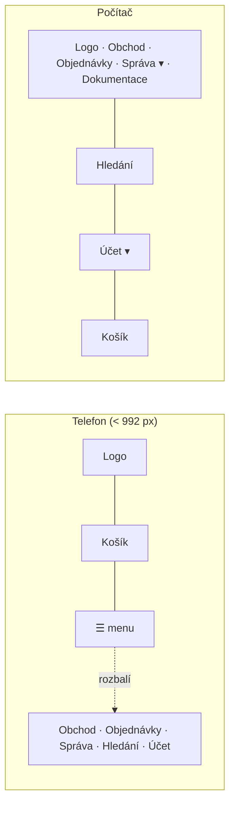
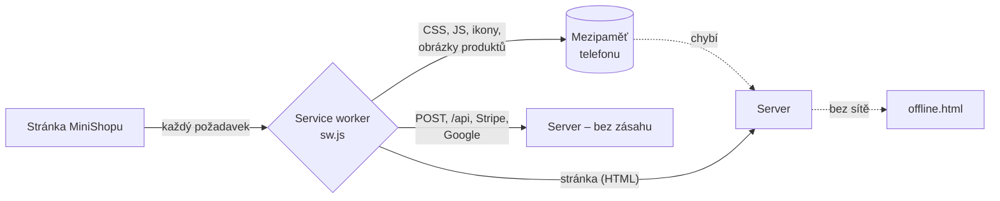
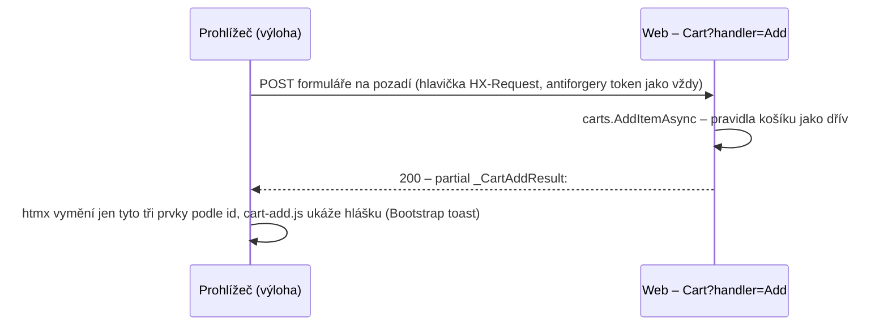

> **V jedné větě:** MiniShop dál stojí na **Bootstrapu 5.3** (lokálně ve `wwwroot/lib`), vlastní vzhled je jen sada
> **CSS proměnných** a pár komponent v [`site.css`](code:src/MiniShop.Web/wwwroot/css/site.css). Stránky se přizpůsobí
> telefonu (*mobile first*) – menu se sbalí do „hamburgeru“, filtry výlohy se vysunou z boku.

## Design systém

Barvy, zaoblení a stíny jsou proměnné na jednom místě (`:root` v `site.css`) – změna vzhledu = změna proměnné,
ne hledání v šablonách. Proměnné `--ms-*` jsou naše, `--bs-*` přepisují výchozí hodnoty Bootstrapu.

| Proměnná | Hodnota | Kde je vidět |
| --- | --- | --- |
| `--ms-brand` | `#4f46e5` (indigo) | tlačítka, odkazy, aktivní stránka, odznak košíku |
| `--ms-canvas` / `--ms-surface` | světle šedá / bílá | pozadí stránky / karty, hlavička |
| `--ms-radius` | `0.875rem` | zaoblení karet |
| `--ms-tap` | `2.75rem` (44 px) | minimální dotyková plocha (ikony v hlavičce, štítky kategorií na dotykovém displeji) |
| `--ms-chip-height` | `2.25rem` (36 px) | štítky kategorií na počítači – vždy na jeden řádek, řada se zalomí; na telefonu se posouvá prstem bez posuvníku |
| `--ms-text`, `--ms-text-subtle`, `--ms-brand-text`, `--ms-header-bg`, `--ms-bar-bg`, `--ms-input-bg`, `--ms-table-head-bg` | (vzhled krok E) | barvy, které se v tmavém režimu mění – tmavé hodnoty v `[data-bs-theme=dark]` |

Písmo je systémové (`system-ui`) – nic se nestahuje a na každém zařízení vypadá „domácky“.

## Hlavička a patička


```mermaid
flowchart LR
    subgraph mobil["Telefon (< 992 px)"]
        m1["Logo"] --- m2["Košík"] --- m3["☰ menu"]
        m3 -.->|rozbalí| m4["Obchod · Objednávky · Správa · Hledání · Účet"]
    end
    subgraph pc["Počítač"]
        p1["Logo · Obchod · Objednávky · Správa ▾ · Dokumentace"] --- p2["Hledání"] --- p3["Účet ▾"] --- p4["Košík"]
    end
```

- [_Layout.cshtml](code:src/MiniShop.Web/Pages/Shared/_Layout.cshtml): Bootstrap `navbar-expand-lg` + `collapse`;
  košík je **mimo** sbalovanou část, takže je vidět i na telefonu.
- Administrace má jedinou rozbalovací nabídku **Správa** (Katalog a objednávky / Přehledy / Provoz).
- Účet ([_LoginPartial](code:src/MiniShop.Web/Pages/Shared/_LoginPartial.cshtml)): rozbalovací nabídka – objednávky,
  nastavení účtu a e-mailů, odhlášení.
- Rozbalování obstarává **Bootstrap JS** (`bootstrap.bundle.min.js` lokálně, ověřený otiskem SRI z oficiálního vydání) –
  soubor, ne inline skript, takže [CSP](moduly/accounts.md) `script-src 'self'` zůstává.

## Výloha a úvod

- **Karta produktu** je jeden partial [_ProductCard](code:src/MiniShop.Web/Pages/Shared/_ProductCard.cshtml)
  (model [ProductCardModel](code:src/MiniShop.Web/Catalog/ProductCardModel.cs)) – stejná ve výloze i na úvodu.
  Celá karta je odkaz na detail, tlačítko „Do košíku“ zůstává samostatně klikací.
- Na telefonu **dvě karty vedle sebe**, cena na jednom řádku a tlačítko pod ní přes celou šířku.
- **Filtry výlohy** jsou `offcanvas-lg`: na počítači sloupec vlevo, na telefonu panel vysunutý tlačítkem *Filtry*.
  Formulář je pořád obyčejný GET (`/Shop?q=…&category=…`) – funguje i bez JavaScriptu a jde sdílet odkazem.
- **Štítky kategorií** nad výsledky (na telefonu vodorovně posuvné).
- **Úvod** ([Index.cshtml.cs](code:src/MiniShop.Web/Pages/Index.cshtml.cs)) je pro zákazníka: hlavní nabídka,
  výhody, kategorie a čtyři doporučené produkty (nejlépe hodnocené skladem) z kopie katalogu.
- **Detail produktu**: obrázek vlevo, „nákupní box“ (cena, dostupnost, Do košíku, doprava, vrácení) vpravo;
  na telefonu pod sebou s tlačítkem přes celou šířku.

## Nákupní cesta (vzhled krok B)

- **Košík** ([Cart/Index](code:src/MiniShop.Web/Pages/Cart/Index.cshtml)): řádky jako karty (obrázek, název, dostupnost,
  množství, cena), souhrn vpravo (na počítači zůstává při rolování na místě), na telefonu **spodní lišta** s cenou
  a tlačítkem *K pokladně*.
- **Pokladna** ([Checkout/Index](code:src/MiniShop.Web/Pages/Checkout/Index.cshtml)): formulář vlevo, souhrn se slevovým
  kódem vpravo; na telefonu nejdřív souhrn (co kupuji), pak formulář a *Objednat*. Doprava a platba jako velké
  klikací **karty** (`.choice-card`, zvýraznění přes `:has(input:checked)`). `fieldset` + `legend`, ID polí, `name`
  a `data-track` zůstaly – sledování a [přehrání](../eda/proud-udalosti.md) pokladny je potřebuje
  (kopie v `Replay.cshtml` má stejné karty).
- **Objednávky**: seznam jako karty (číslo, datum, stav, položky, celkem, akce), detail s položkami a údaji v kartách
  a **průběhem jako svislou časovou osou** (`.timeline`). Štítky stavů mají jemné barvy (`OrderStatusLabels.Badge`).
- **Účet**: všechny stránky ve složce `Pages/Account` mají vlastní layout
  [_AccountLayout](code:src/MiniShop.Web/Pages/Shared/_AccountLayout.cshtml) (nastavený v `Account/_ViewStart.cshtml`) –
  úzká karta uprostřed s logem, tlačítka přes celou šířku. Vnořený layout přeposílá sekce `Scripts` a `Styles`.

## Administrace (vzhled krok C)

- **Hlavička stránky** = partial [_AdminHeader](code:src/MiniShop.Web/Pages/Shared/_AdminHeader.cshtml)
  (model [AdminHeaderModel](code:src/MiniShop.Web/Ui/AdminHeaderModel.cs)): drobečková navigace „Správa › …“ a nadpis.
  Na telefonu je menu Správa schované v ☰ – drobečky ukážou, kde admin je. Nová stránka administrace =
  `<partial name="_AdminHeader" model='new MiniShop.Web.Ui.AdminHeaderModel("Název")' />`.
- **Tabulky** jsou v obalu `table-responsive admin-table` (karta): na telefonu se posouvají do strany uvnitř karty,
  stránka zůstane v šířce displeje. **Nová tabulka v administraci = stejný obal.**
  Seznam *Uživatelé* je na telefonu (pod `md`) jako karty pod sebou (`d-md-none`), tabulka je od `md` výš (`d-none d-md-block`) – admin nemusí posouvat do strany.
- **Expedice**: fronty *K odeslání* a *Na cestě* jako seznam – tlačítka Odeslat / Doručeno jsou na telefonu bez posouvání.
- **Formuláře** zakládání (produkt, kupon, kategorie) a úprava produktu v kartě, na telefonu hlavní tlačítko přes
  celou šířku (`.admin-form`).
- Štítky (role, blokace, stav kuponu, typy událostí průběhu objednávky) mají stejné jemné barvy jako zbytek webu
  (`badge-soft-*`), pruhy grafu tržeb barvu značky.

## Stránkování seznamů

Seznamy, které rostou, se ukazují po stránkách – partial [_Pager](code:src/MiniShop.Web/Pages/Shared/_Pager.cshtml)
(model [PagerModel](code:src/MiniShop.Web/Ui/PagerModel.cs)): „Zobrazeno 21–40 z 135“, odkazy ‹ 1 … 4 5 **6** 7 8 … 20 ›
a výběr **Na stránku** (10 / 20 / 50 / 100, výchozí 20). Výběr odešle [pager.js](code:src/MiniShop.Web/wwwroot/js/pager.js)
(bez JavaScriptu tlačítko *Zobrazit*). Parametry v adrese: `p` (stránka – `page` je v Razor Pages rezervované) a `size`;
odkazy zachovají ostatní parametry (hledání), nesmyslné hodnoty se opraví a stránka za koncem ukáže poslední.

| Stránka | Kde se stránkuje | Hledání |
| --- | --- | --- |
| Objednávky (zákazník i admin) | v databázi (nejnovější první) | číslo objednávky (`order`) – cizí se nenajde |
| Správa → Uživatelé | v databázi (podle e-mailu); útrata jen pro účty na stránce | část e-mailu (`q`) |
| Správa → Faktury, Hodnocení | v databázi (nejnovější první) | — |
| Sklad → Produkty, Správa → Slevové kódy | v paměti (seznam celý ze skladu / desítky kuponů) | — |
| Historie přihlášení (účet, detail uživatele) | v databázi | — |

Záměrně bez stránkování: **Expedice** a **Vratky** (pracovní fronty, hromadné akce), **Zprávy** (poison omezený na 50),
**Tržby** a **Košíky** (souhrny), průběh jedné objednávky. Akce na stránce (skrýt hodnocení, naskladnit produkt…) vrací
na stejnou stránku seznamu (`asp-route-p` / `asp-route-size` a `RedirectToPage(new { p, size })`).

Jádro: [PageRequest a PagedList](code:src/MiniShop.Application/Abstractions/Paging.cs) (Application, bez balíčků) a
[ToPagedListAsync](code:src/MiniShop.Infrastructure/Persistence/PagingExtensions.cs) (COUNT + OFFSET/LIMIT nad seřazeným dotazem).
**Nový seznam, který roste = `PagedList` + `<partial name="_Pager" model="Model.Pager" />`.**

## Instalovatelná aplikace – PWA (vzhled krok D)

MiniShop jde „nainstalovat“ na plochu telefonu (Android/Chrome/Edge tlačítkem **Nainstalovat aplikaci** v patičce nebo
v nabídce účtu, iPhone v Safari přes *Sdílet → Přidat na plochu*). Spustí se z ikony přes celý displej, bez adresního
řádku, bez signálu ukáže stránku „Jste offline“. Je to pořád stejný web – žádný druhý kód ani obchod s aplikacemi.
Na Androidu z něj Chrome sestaví skutečný balíček (WebAPK): aplikace je v seznamu aplikací a odinstaluje se jako každá jiná.


```mermaid
flowchart LR
    P[Stránka MiniShopu] -->|každý požadavek| SW{"Service worker<br/>sw.js"}
    SW -->|"CSS, JS, ikony,<br/>obrázky produktů"| C[(Mezipaměť<br/>telefonu)]
    C -.->|chybí| N[Server]
    SW -->|"stránka (HTML)"| N
    N -.->|bez sítě| O[offline.html]
    SW -->|"POST, /api, Stripe,<br/>Google"| X[Server – bez zásahu]
```

| Soubor | Co dělá |
| --- | --- |
| [manifest.webmanifest](code:src/MiniShop.Web/wwwroot/manifest.webmanifest) | „vizitka“: jméno, ikony (192, 512, *maskable*), barvy, spuštění `/Shop` v režimu `standalone`, zástupci Košík a Moje objednávky |
| [sw.js](code:src/MiniShop.Web/wwwroot/sw.js) | service worker – „vrátný“ mezi stránkou a sítí (pravidla níže) |
| [offline.html](code:src/MiniShop.Web/wwwroot/offline.html) | samostatná stránka bez skriptu a cizích stylů, předem uložená v telefonu |
| [pwa.js](code:src/MiniShop.Web/wwwroot/js/pwa.js) | registrace service workeru, tlačítko instalace (`beforeinstallprompt`), návod pro iPhone |
| [icons/](code:src/MiniShop.Web/wwwroot/icons/icon.svg) | logo (taška v indigo čtverci) jako SVG a PNG; favicon a `apple-touch-icon` |
| [_TabBar](code:src/MiniShop.Web/Pages/Shared/_TabBar.cshtml) | spodní lišta na telefonu: Obchod, Košík (s počtem kusů), Objednávky, Účet / Přihlásit |
| [PwaFiles](code:src/MiniShop.Web/Ui/PwaFiles.cs) | `Cache-Control: no-cache` pro manifest, `sw.js` a offline stránku |

**Pravidla service workeru:**

- **Stránky (HTML) nikdy do mezipaměti** – jsou v nich objednávky, adresy, správa; na sdíleném telefonu nesmí zůstat.
  Stránka jde vždy ze sítě, bez sítě offline stránka.
- **Statické soubory** (`/css/`, `/js/`, `/lib/`, `/icons/`, `/media/products/`) z mezipaměti – rychlý start. Adresy CSS/JS
  mají otisk obsahu (`asp-append-version`), nová verze = nová adresa. Mezipaměť drží nejvýš 150 souborů.
- **POST, cizí weby (Stripe, Google) a ostatní cesty (`/api`)** service worker vůbec neobsluhuje.
- `PRECACHE_VERSION` v `sw.js` = otisk offline stránky a ikony. **Po změně `offline.html` nebo ikony** ho
  [PwaTests](code:tests/MiniShop.Tests/Web/PwaTests.cs) nechá spadnout a napíše správnou hodnotu – nový otisk = nový
  service worker, telefon si stáhne novou offline stránku a starou mezipaměť smaže.
- Service worker běží jen přes HTTPS (nebo `localhost`). E2E scénář *Mobil – aplikace* ověří lištu, registraci a offline stránku
  (`SetOfflineAsync`).

Spodní lišta je jen pod šířkou `lg`; hlavička nahoře zůstala beze změny (`data-track` pro Journeys a E2E). Lišta „K pokladně“
v košíku se drží nad ní (`--ms-tab-bar-height`), `viewport-fit=cover` + `env(safe-area-inset-*)` odsadí výřez a „bradu“ iPhonu.

Navazuje: **oznámení push** (e-shop krok 23, [Notifications](moduly/notifications.md#oznámení-push-e-shop-krok-23)). Mimo tento krok: **Google Play** přes TWA (Trusted Web Activity –
balíček z této PWA, účet vývojáře a soubor `/.well-known/assetlinks.json`).

## Tmavý režim (vzhled krok E)

Výchozí je **Automaticky** – MiniShop je tmavý, když má tmavý vzhled telefon nebo počítač (i v nainstalované aplikaci).
V patičce jde zvolit **Světlý / Tmavý**; volba se pamatuje jen v tomto prohlížeči (`localStorage`, bez serveru a účtu).

- **Jak:** Bootstrap 5.3 přepne své komponenty (formuláře, nabídky, upozornění, tabulky…) sám atributem
  `data-bs-theme="dark"` na `<html>`. Nastavuje ho [theme.js](code:src/MiniShop.Web/wwwroot/js/theme.js) – načítá se
  v hlavičce **před styly a bez `defer`**, aby stránka při načtení bíle neprobliknula (hlídá `PwaTests`).
- **Naše barvy:** proměnné `--ms-*` mají tmavé hodnoty v bloku `[data-bs-theme=dark]` v
  [site.css](code:src/MiniShop.Web/wwwroot/css/site.css) (pozadí `#0d1117`, karty `#161b26`, barva značky jako text
  světlejší `#a5b4fc` – `--ms-brand-text`; tlačítka zůstávají `#4f46e5`). Kontrast textu aspoň WCAG AA.
- **Zůstává světlé:** QR kód 2FA (telefon tmavý nepřečte), pozadí fotek produktů, PDF faktury, e-maily.
- **Dál:** lišta telefonu (`theme-color` pro světlý i tmavý systém), offline stránka podle systému, diagramy v
  dokumentaci v tmavém tématu Mermaid (přepnutí = stránka se znovu načte), Bootstrap `btn-outline-secondary` čitelný ve tmě.
- Bez JavaScriptu zůstává světlý vzhled. E2E scénář *Vzhled* ověří automatiku i ruční volbu.

## Částečné obnovení – htmx (vzhled krok F1)

Stránky jsou dál serverové (Razor Pages), jen vybrané akce se pošlou **na pozadí** a vymění se **kousek stránky** –
bez bliknutí a skoku nahoru. Nástroj: [htmx](https://htmx.org/) (lokálně `wwwroot/lib/htmx`, ~50 kB), do HTML se jen
přidají atributy. Server dál vrací HTML, jen menší.


```mermaid
sequenceDiagram
    participant B as Prohlížeč (výloha)
    participant W as Web – Cart?handler=Add
    B->>W: POST formuláře na pozadí (hlavička HX-Request, antiforgery token jako vždy)
    W->>W: carts.AddItemAsync – pravidla košíku jako dřív
    W-->>B: 200 – partial _CartAddResult: #cart-badge, #cart-badge-tab, #cart-toast (hx-swap-oob)
    B->>B: htmx vymění jen tyto tři prvky podle id, cart-add.js ukáže hlášku (Bootstrap toast)
```

- **„Do košíku“** ([_ProductCard](code:src/MiniShop.Web/Pages/Shared/_ProductCard.cshtml), detail produktu): formulář má
  `hx-post` (stejná adresa), `hx-swap="none"` (nic se nevkládá na místo formuláře) a `hx-disabled-elt` (tlačítko je během
  odesílání neaktivní – dvojklik nepřidá dva kusy). Handler [Cart/Index](code:src/MiniShop.Web/Pages/Cart/Index.cshtml.cs)
  podle hlavičky `HX-Request` vrátí místo přesměrování
  [_CartAddResult](code:src/MiniShop.Web/Pages/Shared/_CartAddResult.cshtml): odznaky košíku a hlášku – **„out-of-band“
  výměna** (`hx-swap-oob`): prvky s tímto atributem si htmx najde na stránce podle `id` a nahradí.
- Obaly s `id` (`#cart-badge` v hlavičce, `#cart-badge-tab` ve spodní liště) mají třídu `htmx-region` = `display: contents`
  – samy se nevykreslují, rozložení hlavičky ani lišty se nemění.
- Hláška je **toast dole** (nad spodní lištou na mobilu) – vidět, ať je zákazník na stránce kdekoli; chyba (vyprodáno,
  víc než 100 kusů) červeně, výpadek sítě nebo serveru ukáže [cart-add.js](code:src/MiniShop.Web/wwwroot/js/cart-add.js).
- **Bez JavaScriptu** (nebo když htmx selže) je to obyčejný formulář – přesměrování zpět jako dřív (postupné vylepšení).
- **Vypršené přihlášení:** přesměrování 302 by htmx načetl potichu na pozadí; cookie autentizace u htmx požadavku pošle
  hlavičku `HX-Redirect` a celá stránka přejde na přihlášení.
- **Bezpečnost:** `<meta name="htmx-config">` – `allowEval: false` (žádné vyhodnocování výrazů – CSP `script-src 'self'`),
  `allowScriptTags: false`, `selfRequestsOnly: true` (jen požadavky na vlastní web), bez vkládaných stylů.
- **E2E** po kliknutí nečekají na adresu (ta se nemění), ale na změnu odznaku košíku a hlášku – a ověří, že se adresa
  ani pozice stránky nezměnily (`ShopFlow.AddToCartAsync`).

### Živý výřez – stav bez obnovení stránky (vzhled krok F2)

Stránky, kde se čeká na něco na pozadí (sága, platba, dopravce, vratka), se dřív každé 2 s **celé načítaly znovu**
(`orders-reload.js`) – blikaly, skákaly nahoru a v Expedici mazaly zaškrtnuté balení i rozepsané číslo zásilky.
Teď se obnovuje jen **výřez**:

```html
<div id="order-live" live-region="@Model.IsLive">   …   </div>
```

- Tag helper [LiveRegionTagHelper](code:src/MiniShop.Web/Ui/LiveRegionTagHelper.cs) při `true` přidá `hx-get` (tatáž
  adresa i s parametry), `hx-trigger` (v F2 `every 3s`, od F3a `live-refresh` – časování v `live-region.js`), `hx-select="#id"` a `hx-swap="outerHTML"` – htmx stáhne na pozadí
  celou stránku, vybere z ní jen výřez a vymění ho. Žádný nový endpoint, výřez se vykresluje stejným kódem jako stránka.
- **Konec dotazování přijde sám:** když už se na nic nečeká, server výřez vykreslí bez atributů (`IsLive = false`)
  a po výměně se htmx přestane ptát.
- **Pojistka rozepsaného formuláře** – [live-region.js](code:src/MiniShop.Web/wwwroot/js/live-region.js): dokud je ve výřezu
  změněné pole (zaškrtnutí, text), rozbalený `<details>` nebo v něm má uživatel kurzor, výměna se odloží na další tik.

| Stránka | Výřez | Obnovuje se, dokud |
| --- | --- | --- |
| Detail objednávky | `#order-live` (vše pod odkazem zpět) | čeká na sklad / platbu / vrácené zboží, předává se dopravci, **zásilku veze dopravce** (nově – průběh zásilky živě) |
| Moje / všechny objednávky | `#orders-live` (seznam; hledání a průběh nad ním) | některá čeká na sklad |
| Platba `/Pay` | `#pay-live` (karta platby) | platba se zakládá; se Stripem pak server pošle `HX-Redirect` na bránu (přesměrování na cizí doménu by htmx na pozadí neprovedl) |
| Expedice | `#fulfilment-live` (všechny tři fronty) | zásilka se předává dopravci nebo je u něj na cestě |
| Vratky | `#returns-live` (seznam) | je otevřená vratka |
| Rychlost vyřízení | `#lead-times-live` (souhrn, tabulka, záložka) | vždy – na signál `staff:orders` se zpožděním 2 s (`live-delay`), po „Přestavět z proudu“ 30 s každé 3 s |

E2E *Nákup kartou* na otevřeném detailu počká na „Potvrzená“ a ověří, že se stránka nenačetla znovu (značka ve `window`).
**Vzhled krok F3a:** výřez s tématem (`live-topic="order:42"`) se obnoví hned na signál od serveru přes SignalR – dotazování
zůstává jen jako pojistka (60 s, v F3a 30 s), bez spojení každé 3 s. Jak signál vzniká a proč se rozesílá každé kopii Webu:
[Živé aktualizace](../eda/zive-aktualizace.md). Tag helper: `hx-trigger="live-refresh"`, kdy obnovit řídí `live-region.js`.
**Proud B2:** `live-delay="2000"` = obnovit až 2 s po signálu (víc signálů během čekání = jedno obnovení) – pro výřez, jehož
data počítá jiná služba ze stejné zprávy (Rychlost vyřízení: Reporting.Api čte proud po dávkách, obnovení hned by ukázalo
stará čísla).

## Ikony

[Icons.cs](code:src/MiniShop.Web/Ui/Icons.cs) – pár ikon jako inline SVG (tvary z Bootstrap Icons, licence MIT):
`@Icons.Cart`, `@Icons.Search`, `@Icons.Menu`… Bez ikonového fontu a bez CDN; barvu berou z textu, velikost z písma.

## Pravidla

- Nová barva nebo rozměr = proměnná v `:root`, ne pevná hodnota v šabloně. **Barva, která se ve tmě mění = i tmavá hodnota v `[data-bs-theme=dark]`** a kontrola v obou režimech (vzhled krok E).
- Soubory z `wwwroot` vždy s `asp-append-version="true"` (jinak prohlížeč po nasazení použije starou verzi z cache).
- Žádné inline `<script>` ani `onclick=` (CSP, hlídá `HardeningTests`); chování = soubor ve `wwwroot/js`
  nebo atributy Bootstrapu (`data-bs-toggle`).
- **Akce bez obnovení stránky (vzhled krok F1) = formulář s `hx-post` + odpověď s prvky `hx-swap-oob` (podle `id`); bez
  JavaScriptu musí fungovat i obyčejný formulář** (handler podle `Request.IsHtmxRequest()` vrátí partial, jinak přesměruje).
  Žádné `hx-on` ani výrazy v `hx-trigger` (`allowEval: false`).
- **Stav, který se mění na pozadí (vzhled krok F2) = živý výřez** `<div id="…" live-region="@Model.IsLive">` – ne obnovení
  celé stránky. Formuláře, které uživatel vyplňuje a nemají se měnit, patří mimo výřez (pojistka v `live-region.js` je
  jen záloha).
- `data-track` a ID polí se nemění – podle nich [sleduje a přehrává](../eda/proud-udalosti.md) průběh pokladny.
- Ověření na mobilu: DevTools (Ctrl+Shift+M) nebo snímek v headless Edge
  (`msedge --headless=new --window-size=500,1200 --screenshot=… https://localhost:7180/Shop` – menší šířku Edge nedovolí).
